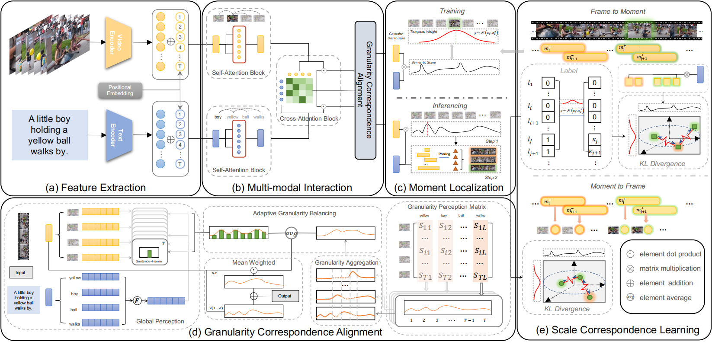

# Explicit Granularity and Implicit Scale Correspondence Learning for Point-Supervised Video Moment Localization (MM 2024)

> MM 2024 paper on explicit granularity and implicit scale correspondence learning for point-supervised video moment localization.

## Authors

**Kun Wang**<sup>1</sup>, **Hao Liu**<sup>1</sup>, **Lirong Jie**<sup>1</sup>, **Zixu Li**<sup>1</sup>, **Yupeng Hu**<sup>1</sup>, **Liqiang Nie**<sup>2</sup>

<sup>1</sup> School of Software, Shandong University, Jinan, China  
<sup>2</sup> School of Computer Science and Technology, Harbin Institute of Technology, Shenzhen, China

## Links

- **Paper**: [Explicit Granularity and Implicit Scale Correspondence Learning for Point-Supervised Video Moment Localization](https://dl.acm.org/doi/10.1145/3664647.3680774)

---

## Table of Contents

- [Updates](#updates)
- [Introduction](#introduction)
- [Highlights](#highlights)
- [Method Overview](#method-overview)
- [Project Structure](#project-structure)
- [Installation](#installation)
- [Checkpoints](#checkpoints)
- [Dataset](#dataset)
- [Usage](#usage)
- [Results](#results)
- [Citation](#citation)
- [Acknowledgement](#acknowledgement)
- [License](#license)
- [Contact](#contact)
---

## Updates

- [04/2026] Initial public code release.

---

## Introduction

This repository contains the implementation of **Explicit Granularity and Implicit Scale Correspondence Learning for Point-Supervised Video Moment Localization** (MM 2024).

Existing point-supervised Video Moment Localization (VML) methods often struggle with explicit granularity alignment and implicit scale perception. SG-SCI introduces a Semantic Granularity and Scale Correspondence Integration framework to model the semantic alignment between video and text. This approach explicitly models semantic relations of different feature granularities and adaptively mines implicit semantic scales, helping the model effectively enhance and utilize modal feature representations of varying granularities and scales.

This repository currently provides:

- Training code
- Training utilities and scripts


---

## Highlights

- Point-supervised Video Moment Localization (VML) using single-frame annotations.
- GCA module + SCL strategy for explicit granularity alignment and implicit scale perception.
- Support for end-to-end model training, multi-modal interaction, and training utilities.

---

## Method Overview



---

## Project Structure

```text
.
|-- asset/                         # Images and figures
|-- src/                           # Main source code
|   |-- config.yaml                # Configurations
|   |-- dataset/                   # Data processing
|   |   |-- dataset.py             # Dataset class
|   |   |-- generate_glance.py     # Annotation script
|   |   |-- generate_duration_*.py # Annotation script
|   |-- model/                     # Model definitions
|   |   |-- building_blocks.py     # Core modules (e.g., GCA)
|   |   |-- model.py               # Main network (e.g., SCL)
|   |-- experiment/                # Training & Evaluation
|   |   |-- train.py               # Training script
|   |   |-- eval.py                # Evaluation script
|   |-- utils/                     # Utility functions
|   |   |-- utils.py               # General utils
|   |   |-- vl_utils.py            # Vision-Language utils
|-- README.md                      # Project documentation
```

---

## Installation

### 1. Clone the repository

```bash
git clone https://github.com/iLearn-Lab/MM24-SG-SCI.git
cd SG-SCI
```

### 2. Create environment

```bash
$ conda create --name sg-sci python=3.7
$ source activate sg-sci
(sg-sci)$ conda install pytorch=1.10.0 cudatoolkit=11.3.1
(sg-sci)$ pip install numpy scipy pyyaml tqdm
```
 


---

## Checkpoints

The cloud links of checkpoints: [Google Drive](https://drive.google.com/drive/folders/1C61gJJCOHDOeIxH058iJlzz_n2VDZXUL?usp=sharing) & [Hugging Face](https://huggingface.co/iLearn-Lab/MM24-SG-SCI).

---

## Dataset

We use Charades-STA and TACoS datasets and splits produced by [VIGA](https://github.com/r-cui/ViGA/tree/master). 

---

## Usage

### Train

```bash
# For TACoS
python -m experiment.train --task tacos
# For Charades-STA
python -m experiment.train --task charadessta
```

### Eval
Put the checkpoints in `LOGGER_PATH`. Run the following commands:
```bash
python -m src.experiment.eval --exp $LOGGER_PATH
```
---


## Results

Bold indicates the best point-supervised result, and <u>underline</u> indicates the second-best point-supervised result.

### Table 1. Performance comparison on Charades-STA with different supervision methods

| Type | Method | R1@0.3 | R1@0.5 | R1@0.7 | mIoU |
| --- | --- | ---: | ---: | ---: | ---: |
| Point-supervised | ViGA [SIGIR22]  | **71.21** | 45.05 | 20.27 | <u>44.57</u> |
| Point-supervised | PSVTG [TMM22]  | 60.40 | 39.22 | 20.17 | 39.77 |
| Point-supervised | CFMR [ACMMM23]  | - | <u>48.14</u> | <u>22.58</u> | - |
| Point-supervised | D3G [ICCV23]  | - | 43.82 | 20.46 | - |
| Point-supervised | SG-SCI (Ours) | <u>70.30</u> | **52.07** | **27.23** | **46.77** |

### Table 2. Performance comparison on TACoS with different supervision methods

| Type | Method | R1@0.3 | R1@0.5 | R1@0.7 | mIoU |
| --- | --- | ---: | ---: | ---: | ---: |
| Point-supervised | ViGA [SIGIR22]  | 19.62 | 8.85 | 3.22 | 15.47 |
| Point-supervised | PSVTG [TMM22]  | 23.64 | 10.00 | 3.35 | <u>17.39</u> |
| Point-supervised | CFMR [ACMMM23]  | 25.44 | <u>12.82</u> | - | - |
| Point-supervised | D3G [ICCV23]  | <u>27.27</u> | 12.67 | <u>4.70</u> | - |
| Point-supervised | SG-SCI (Ours) | **37.47** | **20.59** | **8.27** | **23.83** |

---

## Citation

```bibtex
@inproceedings{wang2024explicit,
  title={Explicit granularity and implicit scale correspondence learning for point-supervised video moment localization},
  author={Wang, Kun and Liu, Hao and Jie, Lirong and Li, Zixu and Hu, Yupeng and Nie, Liqiang},
  booktitle={Proceedings of the 32nd ACM International Conference on Multimedia},
  pages={9214--9223},
  year={2024}
}
```

---

## Acknowledgement

- Thanks to the [ViGA](https://github.com/r-cui/ViGA/tree/master) open-source community for strong baselines and tooling.
- Thanks to all collaborators and contributors of this project.

---

## License

This project is released under the Apache License 2.0.

---

# Contact
**If you have any questions, feel free to contact me at khylon.kun.wang@gmail.com**.
